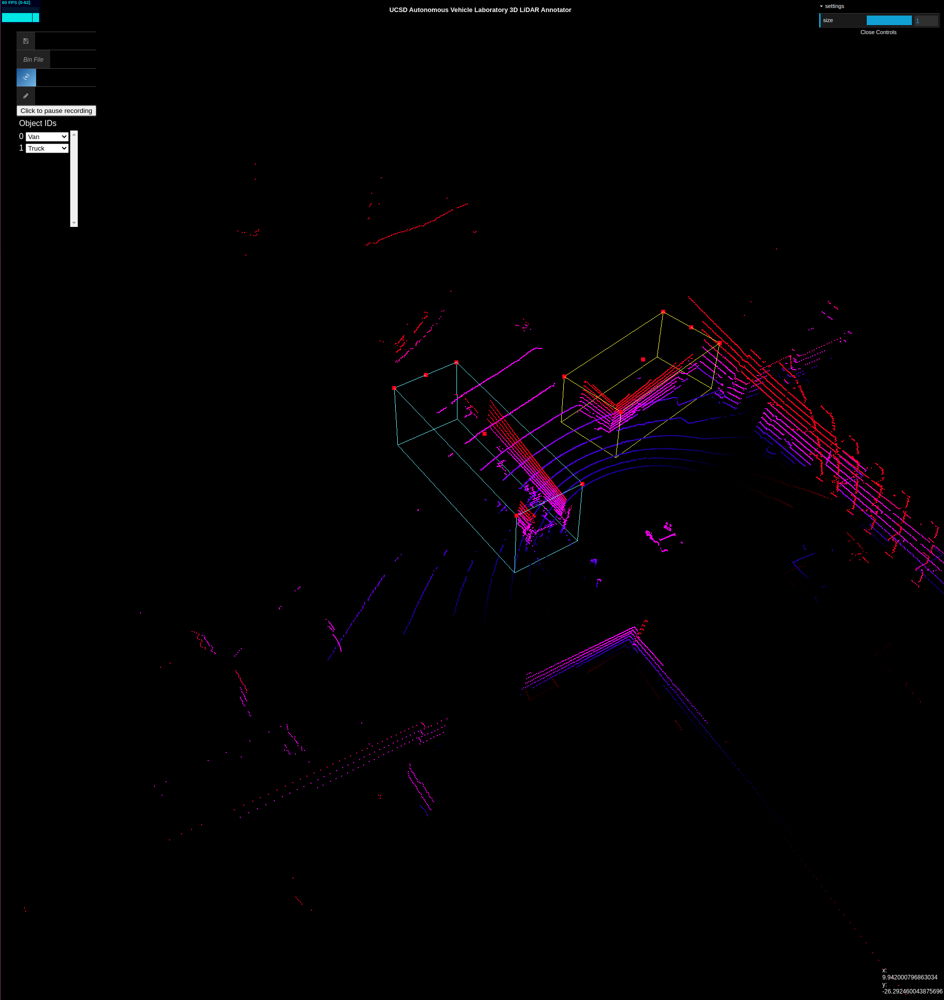
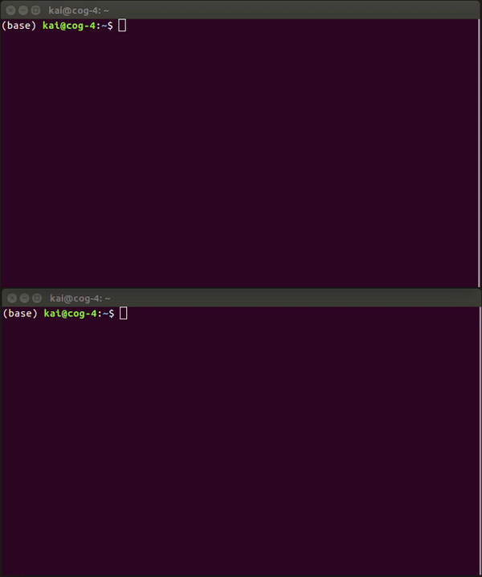
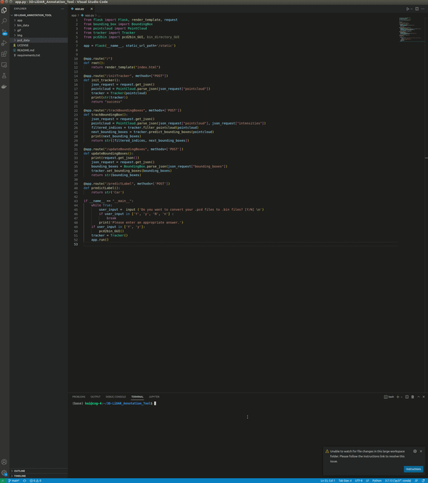
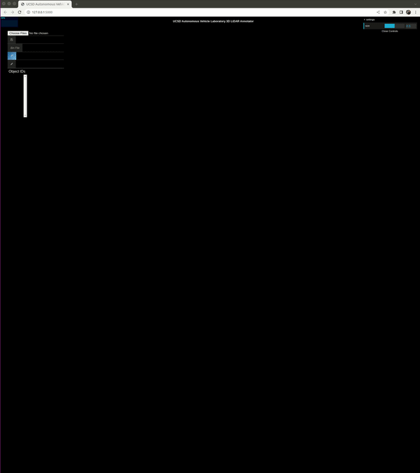
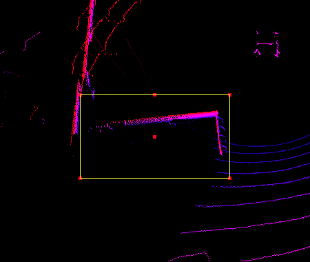
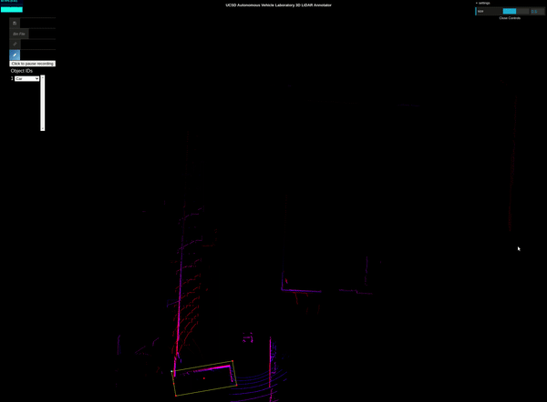
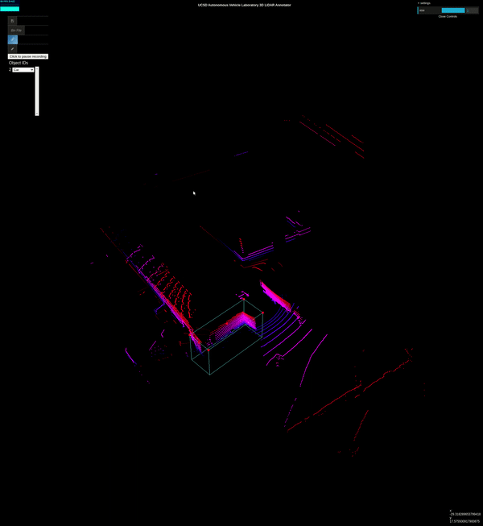

# 3D LiDAR Annotation Tool with pcd2bin Conversion Tool
UCSD Autonomous Vehicle Laboratory (AVL) 3D-LiDAR Annotation Tool



# OS and App Requirements
0. Ubuntu 16.04 LTS
1. Python 3.7.13
2. ROS Kinetic
3. Google Chrome

# Pre-requisites
0. Skip the step (Pre-requisite Step #1) below if the LiDAR data are stored in a binary float matrix format (.bin extension)
    * Each column is a point, where the rows are in the following order: 
        > x, y, z, intensity
1. Converted the bag file to pcd files. 

    

    * Run the command below in a Linux terminal:
        
        `roscore`

    * Run the following command in a **NEW** Linux terminal:
        
        `rosrun pcl_ros bag_to_pcd <input_file.bag> <topic> <output_directory>`

# Installation
0. Git clone the repository
    * `git clone https://github.com/kaitheuser/3D-LiDAR_Annotation_Tool.git`
1. Change directory to `3D-LiDAR_Annotation_Tool` folder
    * `cd 3D-LiDAR_Annotation_Tool`
2. Install dependencies
    * `pip3 install -r requirements.txt`
3. go to https://github.com/klintan/pypcd.git 
4. In the repo, find `pypcd.py` in the `pypcd/pypcd` directory
5. Copy the entire code
6. In your local machine, find `pypcd.py` in the `/Users/username/Library/Python/3.x/lib/python/site-packages/pypcd/pypcd.py`
7. Delete the entire code and paste it.
8. Edit the pypcd.py script from the pypcd python package, it can be in one of the following directories:
    - `/Users/username/Library/Python/3.x/lib/python/site-packages/pypcd/pypcd.py`

    Original Code:

    ```python
    def parse_header(lines):
        metadata = {}
        for ln in lines:
            if ln.startswith('#') or len(ln) < 2:
                continue
            match = re.match('(\w+)\s+([\w\s\.]+)', ln)
    ```

    Modified Code:

    ```python
    def parse_header(lines):
        metadata = {}
        for ln in lines:
            if ln.startswith('#') or len(ln) < 2:
                continue
            ln = ln.replace('_','s',1)
            ln = ln.replace('_','m',1)
            match = re.match('(\w+)\s+([\w\s\.]+)', ln)

# How to Run the 3D LiDAR Annotation Tool with pcd2bin Conversion Tool Application
0. Change directory to `3D-LiDAR_Annotation_Tool` folder
    * `cd 3D-LiDAR_Annotation_Tool`
1. Navigate to the `app` folder in the `3D-LiDAR_Annotation_Tool` folder
    * `cd app`
2. Run the `app.py` to launch the application.
    * `python3 app.py`
3. Decide whether to convert the pcd files to bin files.
    
    * `Y` -> Choose to convert
    0.  Browse For PCD File Directory
    1.  Choose a Directory to save the .bin files
    2.  Click the **Convert PCD to BIN** button to convert
    * `N` -> Already converted
4.  Open **http://127.0.0.1:5000** on the Chrome Browser

# How to Annotate 3D-LiDAR Point Clouds or Objects



0. Click on **Choose Files** Button to select a .bin file to annotate.
1. Click on **Click to start recording** Button to start annotating.
2. Hold **Ctrl** + **Mouse Left Click** and then drag across the screen to draw a 2D-bounding box.



3. Hold **Ctrl** + **Mouse Left Click** on the point that is **NOT** a vertex to rotate the bounding box.
4. Hold **Ctrl** + **Mouse Left Click** on any points that is a **vertex** to change the size of the bounding box.



5. Click on the **3D icon** that is above the **Pen**/**Edit** button to view the point clouds in 3D.
6. Hold **Ctrl** + **Mouse Left Click** on the point that is not on the edge of the box to adjust the height of the bounding box.
7. Slide the **size** sliding bar (top right) to adjust the size of the point clouds.
8. Click on the **Pen**/**Edit** button to change back to 2D view and controls.
9. Edit the object IDs on the **Object IDs** list.
10. Click on the object ID and push the **Delete** key to delete the object label.



11. Click on the **Save icon** to save the bounding boxes information as a json file.

# 2D/3D Controls without Holding "Ctrl"
0. **Left-click** to change the view of map.
1. **Scroll-click** to zoom in and out the map.
2. **Right-click** to move the map.

# Future Development
0. Support .pcd, .pcl, and .bin files.
1. Add **Next Frame** to move to next frame conveniently.
2. Automatic tracking and labeling after the first annotation. 

# Bugs and Fixes
## pypcd Package Issues
### Errors
1. `ImportError: No module named 'cStringIO'`
2. `TypeError: startswith first arg must be bytes or a tuple of bytes, not str`
3. `ValueError: field '__0000' occurs more than once pypcd`
4. `ImportError: cannot import name 'Markup' from 'jinja2'`
5. `ImportError: cannot import name 'escape' from 'jinja2'`

### Solutions
1. To solve Error #1 and Error #2, execute the following commands in the terminal:
    * `pip3 uninstall pypcd`
    * `pip3 install --upgrade git+https://github.com/klintan/pypcd.git`
        - If failed to execute, go to https://github.com/klintan/pypcd.git 
        - In the repo, find `pypcd.py` in the `pypcd/pypcd` directory
        - Copy the entire code
        - In your local machine, find `pypcd.py` in the `/Users/username/Library/Python/3.x/lib/python/site-packages/pypcd/pypcd.py`
        - Delete the entire code and paste it.
        - Then, follow **Solutions #2**.
2. To solve Error #3, edit the pypcd.py script from the pypcd python package, it can be in one of the following directories:
    - `/home/user/anaconda3/envs/py37/lib/python3.7/site-packages/pypcd`
    - `/usr/lib/python3.5/site-packages/pypcd`
    - `/Users/username/Library/Python/3.x/lib/python/site-packages/pypcd/pypcd.py`

    Original Code:

    ```python
    def parse_header(lines):
        metadata = {}
        for ln in lines:
            if ln.startswith('#') or len(ln) < 2:
                continue
            match = re.match('(\w+)\s+([\w\s\.]+)', ln)
    ```

    Modified Code:

    ```python
    def parse_header(lines):
        metadata = {}
        for ln in lines:
            if ln.startswith('#') or len(ln) < 2:
                continue
            ln = ln.replace('_','s',1)
            ln = ln.replace('_','m',1)
            match = re.match('(\w+)\s+([\w\s\.]+)', ln)
    ```
3. To solve Error #4 and Error #5, execute the following commands in the terminal:
    * `pip3 uninstall Flask`
    * `pip3 uninstall Jinja2`
    * `pip3 install Flask==2.0.3`
    * `pip3 install Jinja2==3.1.1`

# Citation
``` 
   @article{wang2019latte,
      title={LATTE: Accelerating LiDAR Point Cloud Annotation via Sensor Fusion, One-Click Annotation, and Tracking},
      author={Wang, Bernie and Wu, Virginia and Wu, Bichen and Keutzer, Kurt},
      journal={arXiv preprint arXiv:1904.09085},
      year={2019}
   }
   ```
`git clone from songanz/3D-LiDAR-annotator`


        
